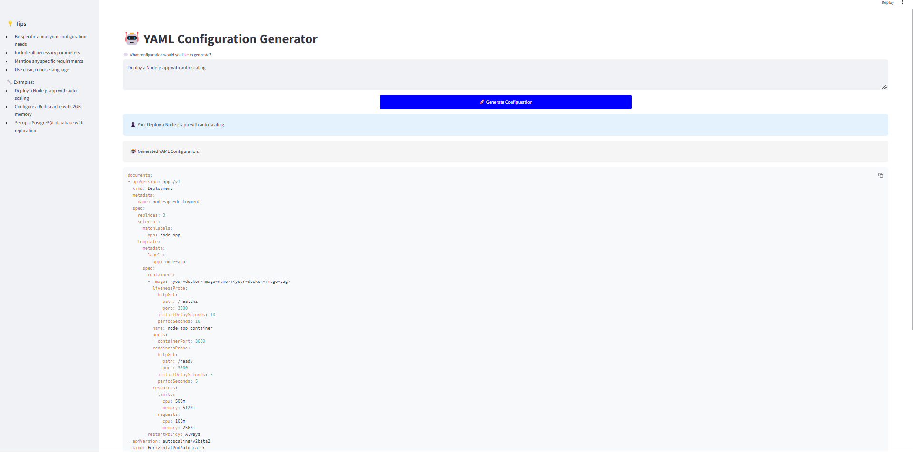

# 🤖 YAML Configuration Generator

A conversational AI tool that converts natural language into Spheron Infrastructure Composition Language (ICL) YAML configurations. Say goodbye to manual YAML writing and hello to intuitive infrastructure deployment!


## 🚀 Features

- 💬 Natural language to YAML conversion
- ✅ Built-in validation for Spheron ICL specifications
- 📝 Interactive chat-based interface
- 💾 One-click YAML downloads
- 🔄 Easy configuration refinement
- 🎨 Modern, user-friendly UI

## Demo


<video width="640" height="360" controls>
  <source src="demo.mp4" type="video/mp4">
  Your browser does not support the video tag.
</video>

## 🛠️ Installation

1. Clone the repository:
```bash
git clone https://github.com/yourusername/yaml-config-generator.git
cd yaml-config-generator
```

2. Create a virtual environment:
```bash
python -m venv venv
source venv/bin/activate  # On Windows: venv\Scripts\activate
```

3. Install dependencies:
```bash
pip install -r requirements.txt
```

4. Set up your API key:
```python
# In app.py, replace YOUR_API_KEY_HERE with your actual Gemini API key
genai.configure(api_key="YOUR_API_KEY_HERE")
```

## 🏃‍♂️ Running the Application

Start the application:
```bash
streamlit run app.py
```

The application will open in your default web browser at `http://localhost:8501`.

## 📝 Usage Example

Simply describe what you want:
```
"Deploy a Node.js application with 2GB RAM and auto-scaling between 2-5 instances"
```

The tool will generate valid YAML:
```yaml
documents:
- apiVersion: apps/v1
  kind: Deployment
  metadata:
    name: node-app-deployment
  spec:
    replicas: 3
    selector:
      matchLabels:
        app: node-app
    template:
      metadata:
        labels:
          app: node-app
      spec:
        containers:
        - image: <your-docker-image-name>:<your-docker-image-tag>
          livenessProbe:
            httpGet:
              path: /healthz
              port: 3000
            initialDelaySeconds: 10
            periodSeconds: 10
          name: node-app-container
          ports:
          - containerPort: 3000
          readinessProbe:
            httpGet:
              path: /ready
              port: 3000
            initialDelaySeconds: 5
            periodSeconds: 5
          resources:
            limits:
              cpu: 500m
              memory: 512Mi
            requests:
              cpu: 100m
              memory: 256Mi
        restartPolicy: Always
- apiVersion: autoscaling/v2beta2
  kind: HorizontalPodAutoscaler
  metadata:
    name: node-app-hpa
  spec:
    maxReplicas: 10
    metrics:
    - resource:
        name: cpu
        targetAverageUtilization: 80
      type: Resource
    minReplicas: 1
    scaleTargetRef:
      apiVersion: apps/v1
      kind: Deployment
      name: node-app-deployment
```

## 🎯 Problem it Solves

- Eliminates the need to memorize YAML syntax
- Speeds up infrastructure configuration
- Reduces deployment errors
- Makes Spheron ICL accessible to developers of all experience levels
- Streamlines the configuration process through natural conversation

## 📋 Requirements

- Python 3.8+
- Streamlit 1.28+
- Google Generative AI API access
- PyYAML
- PyPDF

## 🔧 Configuration

Key configuration options in `app.py`:

```python
# Generation settings
generation_config = {
    "temperature": 0.1,  # Lower for more consistent outputs
    "top_p": 0.8,
    "top_k": 40,
}

# Page configuration
st.set_page_config(
    page_title="YAML Config Generator",
    page_icon="🤖",
    layout="wide"
)
```

## 🤝 Contributing

1. Fork the repository
2. Create your feature branch (`git checkout -b feature/AmazingFeature`)
3. Commit your changes (`git commit -m 'Add some AmazingFeature'`)
4. Push to the branch (`git push origin feature/AmazingFeature`)
5. Open a Pull Request

## 📜 License

Distributed under the MIT License. See `LICENSE` for more information.

## ✨ Acknowledgements

- [Streamlit](https://streamlit.io/) for the web interface
- [Google Generative AI](https://ai.google.dev/) for natural language processing
- [Spheron](https://spheron.network/) for ICL specifications

## 📞 Support

For support:
- Open an issue in this repository
- Contact: support@example.com
- Documentation: [Link to docs]

## 🛣️ Roadmap

- [ ] Support for more complex networking configurations
- [ ] Custom template support
- [ ] Configuration version control
- [ ] Team collaboration features
- [ ] Integration with CI/CD pipelines

---
Built with ❤️ for the Spheron community
